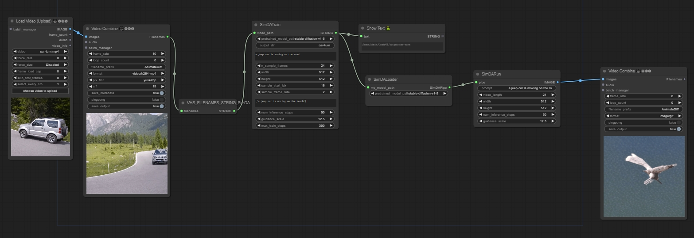

# ComfyUI-SimDA

## workflow

### Train & Inference

[train & inference](https://github.com/chaojie/ComfyUI-SimDA/blob/main/wf.json)



### Model Weights

[Stable Diffusion] Stable Diffusion is a latent text-to-image diffusion model capable of generating photo-realistic images given any text input. The pre-trained Stable Diffusion models can be downloaded from Hugging Face (e.g., Stable Diffusion v1-4, v2-1). You can also use fine-tuned Stable Diffusion models trained on different styles (e.g, Modern Disney, Anything V4.0, Redshift, etc.).

stable-diffusion-v1-5

```
 huggingface-cli download --resume-download runwayml/stable-diffusion-v1-5 --local-dir ~/ComfyUI/models/diffusers/stable-diffusion-v1-5 --local-dir-use-symlinks False
```

### Notes

pip install diffusers[torch]==0.11.1


## [SimDA](https://github.com/ChenHsing/SimDA)